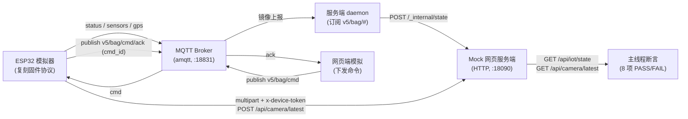

# smart-bag-testing

> 智能书包「端—边—云」端到端联调测试套件：用 Python 复刻真实 MQTT / HTTP 协议契约，一条命令在零硬件、秒级的条件下验证全链路逻辑是否打通。


---

## 这是什么

智能书包系统由三方组成：ESP32-S3 固件（设备端）、Jetson 边缘语音子系统（边端）、网页服务端（云端），三者之间靠一套固定的 **MQTT topic + HTTP 端点契约**通信。真机联调需要硬件上电、热点联网、能访问生产 broker，门槛高、复现慢。

本仓库把这条链路里的每个角色都用 Python 模拟出来，并严格复刻真实固件与服务端的协议契约，从而在**纯软件、零硬件、秒级**的条件下验证三条关键数据流：设备上报能否被服务端正确镜像、摄像头快照能否上传与回拉、云端下行命令能否驱动设备并收到 `cmd_id` 匹配的 ACK。它既是离线兜底的回归测试，也是接真机前确认「软件契约本身没问题」的基准。

核心入口 `selftest_oneshot.py` 把 broker、服务端 daemon、模拟网页服务端、模拟 ESP32 全部塞进**单进程多线程**，跑完 8 项断言后给出 `PASS/FAIL` 汇总并以退出码反映结果；另有三个拆分脚本，可把地址换成生产值后对真实链路逐段联调。

> 在线地址：无。本套件是本地运行的测试工具，不涉及线上部署。

## ✨ 核心特性

- **一键自测，零外部服务**：`selftest_oneshot.py` 内置 `amqtt` broker（asyncio 后台线程）、HTTP mock 服务端、服务端镜像 daemon 与 ESP32 模拟器，一条命令即可在本机跑完全链路，无需另起 broker 或网页后端，便于 CI / 离线复现。
- **严格复刻固件协议契约**：`esp32_sim.py` 按真实 `MQTT.cpp` / `camera.cpp` 行为建模——连接时设 LWT `{"status":"offline"}`、上线发 `{"status":"online"}`、订阅 `v5/bag/cmd`、周期上报 sensors/gps、ACK 字段必须叫 `cmd_id`，避免「模拟器跑通但真机不通」的失真。
- **覆盖三条关键数据流**：设备上行镜像（status/sensors/gps → `/api/iot/state`）、摄像头快照（multipart 上传 + `x-device-token` 鉴权 → 回拉 `image/jpeg`）、云端命令闭环（`screen_text` / `mode_switch` 下发 → 设备驱动屏幕/灯效 → 回 ACK 且 `cmd_id` 匹配）。
- **真实 MQTT 协议而非打桩**：测试走真正的 MQTT 3.1.1 broker 与 paho-mqtt 客户端，验证的是协议级行为（通配订阅 `v5/bag/#`、LWT 遗嘱、发布/订阅闭环），而不是函数调用打桩。
- **自洽鉴权设计**：模拟器上传与 mock 校验共用同一个 `BAG_DEVICE_TOKEN`，本地留空即全绿；接真机时只需 `export BAG_DEVICE_TOKEN=<令牌>`，同一套脚本即可指向生产端点。
- **拆分脚本支持真机分段联调**：`daemon_mirror.py` / `mock_web_server.py` / `esp32_sim.py` 接受 broker / 端口 / web 地址作为命令行参数，可单独启动、对真实生产链路逐段排错。

## 🏗 架构

`selftest_oneshot.py` 在单进程内启动四个线程（broker、mock-web、daemon、ESP32），并由主线程驱动一个网页端 MQTT 客户端，模拟完整的端—边—云链路：



数据流要点：

- 设备在线判定**只认** `v5/bag/status = {"status":"online"}`；sensors / gps 只更新对应字段。
- daemon 以 `v5/bag/#` 通配订阅，把上报镜像到服务端状态（等价于真实后端将数据写入 Redis `bag:latest`）。
- 命令下行 `{id, action, value}`，设备回执 `{cmd_id, status, msg}` 且 `cmd_id == id` 才算闭环；未知 action / 非法 mode 回 `status=1`。

## 🧰 技术栈

| 维度 | 选型 | 说明 |
| --- | --- | --- |
| 语言 | Python 3.8+ | 仅用标准库 + 两个 MQTT 依赖；无打包配置 |
| MQTT 客户端 | `paho-mqtt` | 设备 / 守护 / 网页端模拟均用 MQTT 3.1.1（`MQTTv311`） |
| 内嵌 Broker | `amqtt` | 仅 `selftest_oneshot.py` 用；asyncio broker 跑在后台线程 |
| HTTP 服务端 | `http.server`（标准库） | `ThreadingHTTPServer` 实现 mock 网页端点 |
| 数据格式 | JSON / multipart-form | MQTT 载荷为 JSON；摄像头快照走 multipart，字段名 `image` |

> 仓库未提供 `requirements.txt` / `pyproject.toml`，依赖以源码 `import` 为准：`paho-mqtt`（全部脚本）、`amqtt`（仅一键自测）。

## 🚀 快速开始

前置依赖：Python 3.8+、pip。

```bash
# 1. 克隆
git clone https://github.com/bei666qi-pan/smart-bag-testing.git
cd smart-bag-testing

# 2. 安装依赖
pip install paho-mqtt amqtt

# 3. 一键全链路自测（自带 broker，零外部服务）
python3 selftest_oneshot.py
```

预期输出（8/8 全绿即代表软件链路逻辑打通）：

```text
=== 全链路联调测试（单进程一体化）===
[PASS] 步骤1 state接口可达(daemon已起)
[PASS] 步骤2 设备 status=online 镜像 -> status=online
[PASS] 步骤3 sensors 镜像 temp=24.5 humid=45.0 battery=88
[PASS] 步骤4 gps 镜像 lat=31.230412 lng=121.473701
[PASS] 附加 摄像头快照上传->拉取(image/jpeg)
[PASS] 步骤5 screen_text 驱动屏幕 t_writing/t_replay t_writing='记得带作业本'
[PASS] 步骤6 设备回 cmd/ack 且 cmd_id 匹配(命令闭环)
[PASS] 附加 mode_switch focus_mode 驱动呼吸蓝灯+ACK

=== 结果: 8/8 通过 ===
```

进程退出码：全部通过返回 `0`，否则返回 `1`，可直接用于脚本 / CI 判定。

### 对真实链路分段联调（可选）

拆分脚本接受 `broker host / port / web url` 作为位置参数，把地址换成生产值即可分别启动：

```bash
# 服务端镜像守护进程（订阅生产 broker，把状态镜像到指定 web）
python3 daemon_mirror.py <broker-host> 1883 https://<your-web-host>

# 独立 mock 网页服务端（位置参数为监听端口，默认 8090）
python3 mock_web_server.py 8090

# ESP32 设备模拟器（broker / port / web [/ 状态落盘路径]）
export BAG_DEVICE_TOKEN=<令牌>      # 真实联调需设置；本地自测留空
python3 esp32_sim.py <broker-host> 1883 https://<your-web-host>
```

## ⚙️ 配置

本套件不读取 `.env` 文件，唯一外部配置是一个环境变量：

| 变量 | 用途 | 默认值 |
| --- | --- | --- |
| `BAG_DEVICE_TOKEN` | 摄像头快照上传鉴权头 `x-device-token` 的值 | 空字符串（本地自测自洽，全绿） |

- 本地自测：留空即可——模拟器上传与 mock 校验用的是同一个值（都为空），鉴权天然通过。
- 真实联调：`export BAG_DEVICE_TOKEN=<令牌>`，再让脚本指向生产端点。

> 请勿将真实令牌写入仓库或命令历史。本仓库源码中 `BAG_DEVICE_TOKEN` 默认即为空字符串，不含任何真实密钥。

端口与地址（写在源码常量 / 参数默认值中，一般无需改动）：

| 项 | selftest_oneshot.py | 拆分脚本默认 |
| --- | --- | --- |
| MQTT broker | `127.0.0.1:18831` | `127.0.0.1:1883` |
| 网页服务端 | `127.0.0.1:18090` | `127.0.0.1:8090` |

## 📁 目录结构

```text
smart-bag-testing/
├── selftest_oneshot.py        # 入口：单进程一体化全链路自测（broker+daemon+web+ESP32+8 项断言）
├── esp32_sim.py               # ESP32 设备模拟器，严格复刻固件 MQTT / camera 协议契约
├── daemon_mirror.py           # 服务端守护进程：通配订阅 v5/bag/# 并镜像状态到 web
├── mock_web_server.py         # 模拟网页服务端：/api/camera/latest、/api/iot/state 等端点
├── 远程联调操作手册.md         # OTA 无线烧录 + telnet 远程日志 + MQTT 联调操作流程
├── 联调报告.md                 # 软件全链路联调结论（8/8 通过，g++ 桩 + 模拟链路）
├── Jetson统一联调_提示词.md    # Jetson 端「端—边—云」统一联调任务说明（分阶段）
├── Jetson统一联调报告.md       # 真机 + 生产后端的逐阶段实测证据与修复记录
└── .gitignore
```

## 契约速记

供查阅的真实链路契约（细节以网页服务端《软硬件对接文档》为准）：

| 类别 | 约定 |
| --- | --- |
| 设备上报 topic | `v5/bag/status`、`v5/bag/sensors`、`v5/bag/gps`、`v5/bag/cmd/ack` |
| 设备订阅 topic | `v5/bag/cmd` |
| 在线判定 | 只认 `v5/bag/status = {"status":"online"}` |
| 下行命令 | `{id, action, value}`；`action ∈ {screen_text, mode_switch}` |
| 命令回执 | `{cmd_id, status, msg}`，要求 `cmd_id == id` |
| 摄像头上传 | `POST /api/camera/latest`，header `x-device-token`，multipart 字段名 `image` |
| 服务端状态 | `GET /api/iot/state`（套件内 `/api/iot/status` 为等价别名） |

## 部署

不适用。本仓库是本地运行的联调测试套件，不对外提供服务、无线上部署。其验证目标——智能书包网页服务端——单独走「GitHub（事实源）→ Gitee 镜像 → Coolify（火山引擎 ECS）」链路部署，与本套件无关。

## 许可证

未声明许可证（仓库未包含 LICENSE 文件）。

## 致谢

模拟脚本的协议行为以智能书包 ESP32 固件（`MQTT.cpp` / `camera.cpp`）与网页服务端《软硬件对接文档》第 7、8 节为唯一权威依据建模，确保软件契约验证与真机一致。
